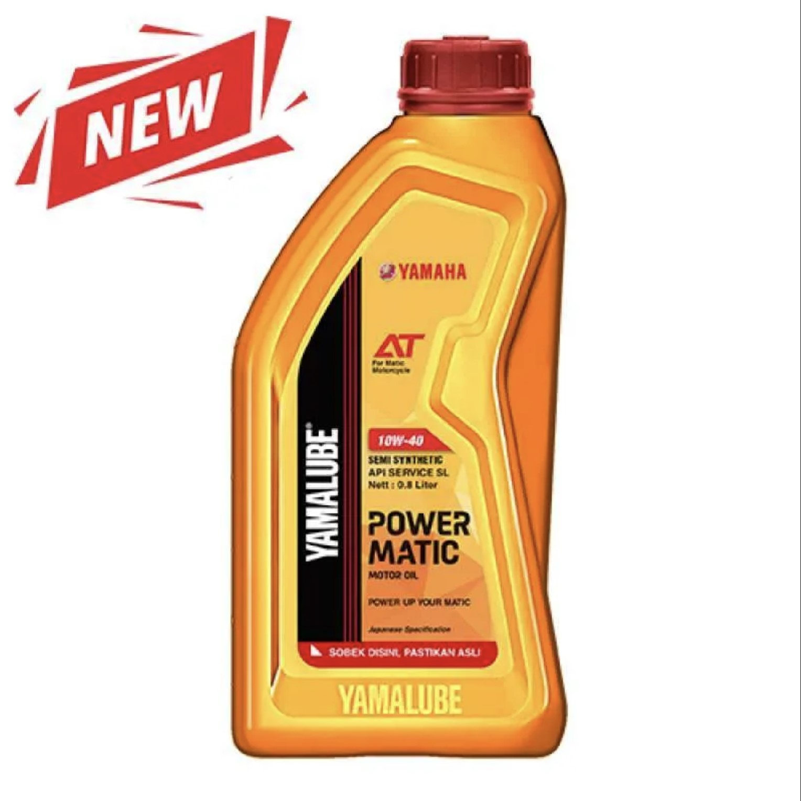

# 🚗 Auto Clinic Mobile App


> **Modern Automotive Service & E-commerce Application**  
> _Built with React, Ionic, and Capacitor tailored for high-performance mobile experiences._

---

## 📖 About The Project

**Auto Clinic** is a cutting-edge mobile application designed to simplify automotive services and product purchasing. Whether booking a service appointment or buying spare parts, Auto Clinic provides a seamless, premium user experience.

Built with **Ionic 8** and **React 19**, it ensures a native-like feel across Android and iOS devices, powered by **Vite** for lightning-fast development and performance.

### ✨ Key Features

- **📱 Hybrid Mobile Experience**: Cross-platform compatibility (iOS & Android) using Capacitor.
- **🎨 Stunning UI/UX**: Crafted with Ionic components and custom themes for a modern look.
- **🛍️ Product Showcase**: Browse products with smooth swiping interactions (powered by Swiper).
- **🌍 Internationalization**: Multi-language support ready (i18next).
- **🛒 Shopping Functionality**: Integrated cart and product management.
- **🔐 User Management**: Context-based state management for user sessions.

---

## 🛠️ Technology Stack

This project leverages the latest web technologies to deliver a robust mobile app:

| Tech | Description |
| :--- | :--- |
| **React 19** | The library for web and native user interfaces. |
| **Ionic 8** | The mobile SDK for the open web. |
| **TypeScript** | Typed JavaScript for scalable development. |
| **Vite** | Next Generation Frontend Tooling. |
| **Capacitor** | Native runtime for building web native apps. |
| **Swiper** | The most modern mobile touch slider. |
| **i18next** | Internationalization framework. |

---

## 📸 Snapshots

Take a look at our product interface:

| Product View 1 | Product View 2 | Product View 3 |
| :---: | :---: | :---: |
|  |  |  |

---

## 🚀 Getting Started

Follow these steps to get a local copy up and running.

### Prerequisites

*   Node.js (LTS recommended)
*   npm

### Installation

1.  **Clone the repository**
    ```sh
    git clone https://github.com/marsilodanang20/E-COMMERCE_APP.git
    cd E-COMMERCE_APP
    ```

2.  **Install dependencies**
    ```sh
    npm install
    ```

3.  **Run the development server**
    ```sh
    npm run dev
    # or for ionic specific
    ionic serve
    ```

4.  **Build for Production**
    ```sh
    npm run build
    ```

5.  **Sync with Capacitor (for Mobile)**
    ```sh
    npx cap sync
    ```

---

## 📂 Project Structure

```bash
E-COMMERCE_APP/
├── public/              # Static assets (Banners, Products)
├── src/
│   ├── components/      # Reusable UI components
│   ├── context/         # App State (User Context)
│   ├── pages/           # Application Screens
│   ├── theme/           # Global Styles & Variables
│   ├── locales/         # i18n translation files
│   ├── App.tsx          # Main App Component
│   └── main.tsx         # Entry Point
├── capacitor.config.ts  # Capacitor Configuration
└── vite.config.ts       # Vite Configuration
```

---

## 🤝 Contributing

Contributions are what make the open source community such an amazing place to learn, inspire, and create. Any contributions you make are **greatly appreciated**.

1.  Fork the Project
2.  Create your Feature Branch (`git checkout -b feature/AmazingFeature`)
3.  Commit your Changes (`git commit -m 'Add some AmazingFeature'`)
4.  Push to the Branch (`git push origin feature/AmazingFeature`)
5.  Open a Pull Request

---

<p align="center">
  Made with ❤️ by Marsilo Danang W
</p>
